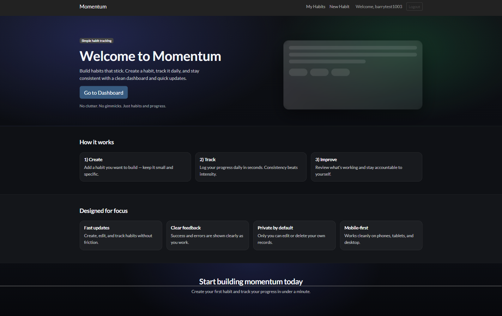
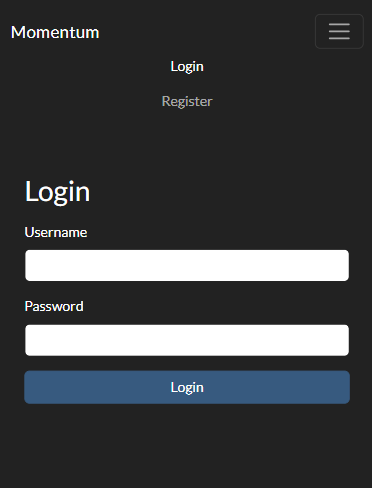
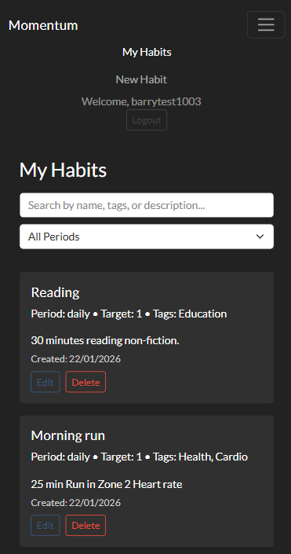
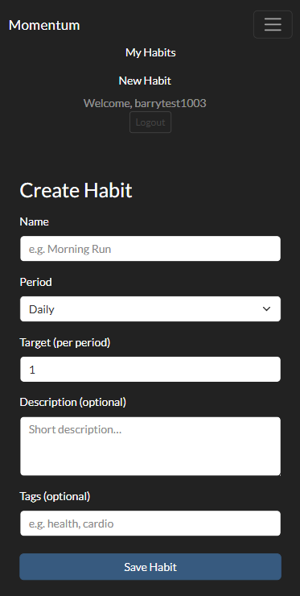
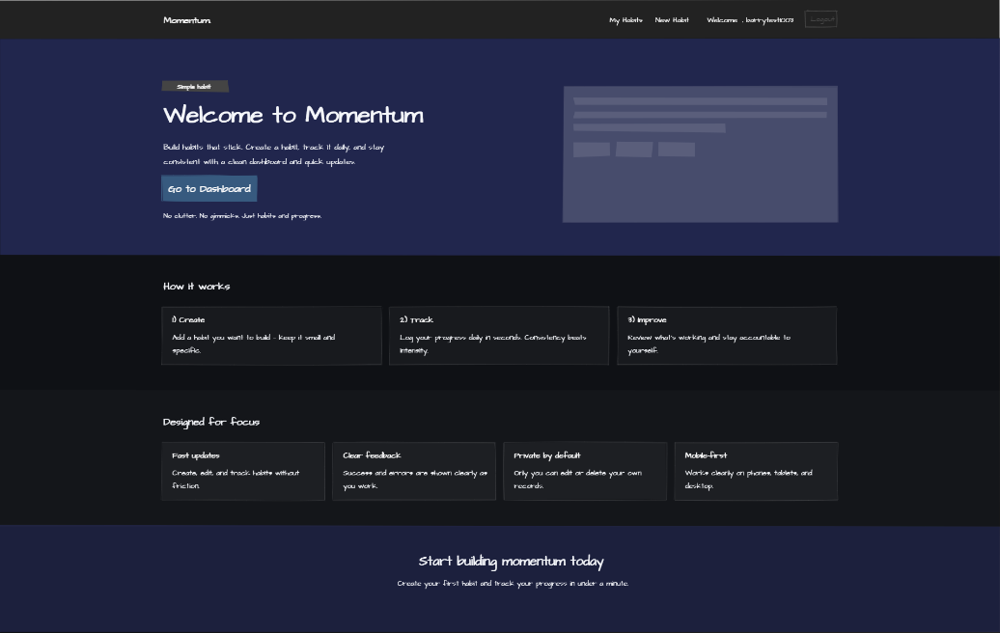
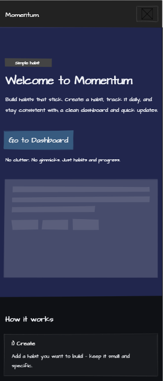
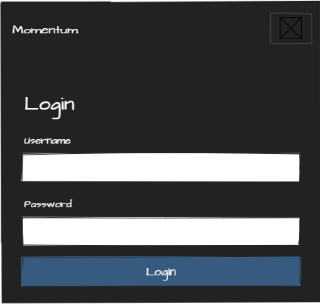
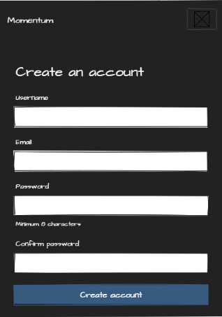
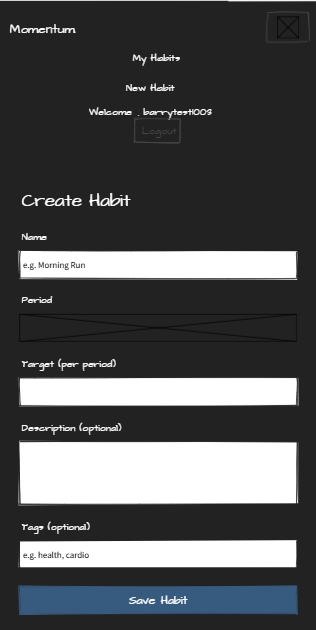

# Momentum – Frontend

## Introduction

Project Milestone 5 for the Code Institute Full Stack Software Development programme. Momentum is a frontend React application deployed to Heroku.

The application allows users to register, log in, and manage personal habits through a clean and intuitive interface. Authenticated users can create, view, update, and delete their own habits, with access restricted by ownership.

Momentum is designed to demonstrate React fundamentals, secure API integration, predictable state management, and responsive user interface design. The project focuses on clarity, usability, and alignment with assessment requirements.

This project is a resubmission of Code Institute’s Portfolio Project 5 and meets all Pass-level criteria for functionality, testing, and deployment.

---

## Table of Contents

- [Introduction](#introduction)
- [Agile Methodology](#agile-methodology)
- [UX](#ux)
- [Features](#features)
- [Design](#design)
- [Technology Stack](#technology-stack)
- [Testing](#testing)
- [Deployment](#deployment)
- [Local Development](#local-development)
- [Known Issues](#known-issues)
- [Credits](#credits)

---

## Agile Methodology

The project followed an Agile development approach using a GitHub Project board to track user stories, tasks, and progress throughout development.

User stories were written in the format:

> As a user, I want to…, so that…

The GitHub Project board can be viewed here:  
https://github.com/users/Bear81/projects/8

Milestones were used to organise development phases and track progress. Core functionality was prioritised to ensure assessment requirements were met, with additional ideas recorded as future enhancements.

### Board Structure

Development was tracked using a GitHub Project board with Epics and user stories grouped by feature area:

- Authentication
- Habit CRUD
- UX / UI improvements
- Documentation and testing evidence
- Deployment and security verification

### Evidence Traceability

Each completed feature was developed against a corresponding board card and validated through manual testing.
Final documentation updates (README/TESTING) were tracked as separate tickets to ensure evidence matched the implemented functionality.

---

## UX

The user experience of Momentum was designed to be simple, focused, and intuitive. The application avoids unnecessary complexity and presents only the information required for users to manage their habits effectively.

Clear navigation, consistent layouts, and predictable interactions were prioritised to ensure users can quickly understand how to use the application without prior instruction.

---

### User Goals

The primary user goals supported by the application are:

- Register an account securely
- Log in and maintain authentication across sessions
- Create personal habits
- View an overview of all owned habits
- Edit or delete habits as required
- Log out securely
- Use the application comfortably on desktop and mobile devices

---

### User Journeys

#### New User Journey

1. User lands on the homepage and is presented with a clear explanation of the application’s purpose
2. User navigates to the registration page via call-to-action buttons
3. User registers an account and is redirected to the login page
4. User logs in and is redirected to the habit list page

---

#### Returning User Journey

1. User visits the application and logs in
2. Authentication state persists across page refresh
3. User is taken directly to their habit list
4. User can create, edit, or delete habits as needed
5. User logs out, clearing authentication state

---

#### Error and Edge Case Handling

- Invalid login credentials result in clear error messages
- Form validation errors are displayed inline
- Unauthorized access attempts are prevented
- Empty states (e.g. no habits created) are handled gracefully

### UX Design Decisions (Implemented)

Momentum was intentionally designed as a low-friction habit tool:

- The landing page uses a single clear value proposition and call-to-action to reduce decision fatigue.
- Navigation changes based on authentication state to prevent users accessing pages that require login.
- Forms use inline validation and clear error messaging to minimise failed submissions.
- Empty states (e.g., “No habits found”) are explicitly handled to avoid blank screens and confusion.

---

## Features

### Feature Screenshots

**Landing Page**


**Login**


**Habits List**


**Create Habit**


### Landing Page

The landing page provides a clear introduction to the Momentum application and its purpose.

- Explains the core functionality of the application
- Presents clear call-to-action buttons guiding users to register or log in
- Uses a clean and minimal layout to ensure immediate understanding
- Adapts responsively to different screen sizes

This page is accessible to all users and serves as the primary entry point to the application.

---

### Authentication

#### User Registration

New users can create an account using the registration form.

- Username and password input fields
- Client-side validation to prevent empty submissions
- Clear error messages returned from the API when validation fails
- Successful registration redirects the user to the login page

This ensures that only registered users can access protected features of the application.

---

#### User Login

Registered users can log in to access their personal habit data.

- Username and password authentication
- JWT tokens are returned by the backend API on successful login
- Tokens are stored client-side to maintain authentication state
- Authentication state persists across page refresh
- Invalid credentials result in clear user-facing error messages

---

#### Logout

Authenticated users can log out of the application at any time.

- Logout clears stored authentication tokens from the browser
- Authentication state is reset in the application context
- Users are redirected to the login page after logging out

Logout is handled client-side and does not rely on server-side token invalidation.

---

### Habit Management (CRUD)

Authenticated users can manage their own habits through full CRUD functionality.

#### Create Habit

- Users can create a new habit using a dedicated form
- Required fields are validated before submission
- Form validation errors are displayed clearly to the user
- On successful submission, the habit is saved via the API and the user is redirected to their habit list

---

#### View Habits

- Users can view a list of all habits they have created
- Habit data is retrieved from the backend API on page load
- Loading and empty states are handled gracefully
- Users are informed when no habits exist

---

#### Update Habit

- Users can edit existing habits they own
- Existing habit data is pre-filled into the edit form
- Changes are validated before submission
- Updated habit data is persisted via the API

---

#### Delete Habit

- Users can delete habits they own
- Deletion requires user confirmation to prevent accidental removal
- Deleted habits are immediately removed from the habit list

---

#### Ownership Enforcement

- Users can only edit or delete habits they have created
- Backend permissions ensure unauthorized access is prevented
- The frontend reflects permission restrictions appropriately

This ensures user data remains private and secure.

---

### Responsive Design

- The application is fully responsive across desktop, tablet, and mobile devices
- Layouts adjust dynamically to screen size
- Navigation remains usable on smaller screens through collapsible menus

## Design

## Wireframes / UI Planning

Wireframes were created to plan the layout, content hierarchy, and user flows before development began. The application was designed using a mobile-first approach, with layouts then adapted for larger screens.

During development, minor adjustments were made to spacing, component sizing, and navigation behaviour to improve usability and responsiveness. The final implementation closely reflects the original wireframes.

### Landing Page

**Desktop**


**Mobile**


---

### Authentication

**Login (Mobile)**


**Register (Mobile)**


---

### Habit Management

**Habits List (Mobile)**


**Create Habit (Mobile)**


### Visual Design

Momentum uses a dark, high-contrast theme to support readability and reduce glare. The interface relies on:

- clear typographic hierarchy (large headings, readable body text)
- consistent spacing and card layouts for scan-friendly reading
- a single primary action style (buttons/CTAs) to reinforce predictable interactions

### Colours

A clean, high-contrast palette was chosen to prioritise readability and accessibility. Accent colours are used sparingly to highlight:

- primary actions (e.g. submit / dashboard navigation)
- status feedback (alerts and validation states)

---

## Future Features

The following features are planned for future development:

- Habit completion tracking and streaks
- Progress visualisation and statistics
- Reminder notifications
- Dark mode toggle

---

## Component Structure

## Component Structure

The frontend is structured to keep responsibilities clear and state predictable:

- `RootLayout` provides consistent layout and applies page-level container rules.
- `NavBar` renders navigation links conditionally based on authentication state.
- `AuthContext` owns authentication state and token persistence, exposing `login` and `logout` actions.
- Page components (`Home`, `Login`, `Register`, `HabitsList`, `CreateHabit`, `EditHabit`, `DeleteHabit`) manage local UI state relevant to their route.
- A single Axios instance (`src/api/axios.js`) centralises API configuration, token injection, and global error handling.

---

## Technology Stack

- React
- React Router
- React Bootstrap
- Axios
- JavaScript
- HTML5
- CSS3

---

## Testing

Testing was carried out throughout development to ensure core functionality worked correctly and the application behaved consistently across environments.

Both manual and automated testing were used, alongside validation and performance checks. The application was tested in local development and in the deployed Heroku environment to confirm production behaviour matched expected results.

A full breakdown of manual test cases, validation results, and supporting screenshots is provided in the dedicated testing document:

- Frontend testing documentation: `MOMENTUM_FRONTEND_TESTING.md`

---

### Manual Testing

Manual testing focused on validating complete user journeys and ensuring the application met the assessment requirements. This included:

- Registration, login, and logout flows
- JWT persistence across page refresh
- Habit CRUD operations (create, list, update, delete)
- Ownership rules preventing modification of other users’ habits
- Form validation behaviour and error messaging
- Empty states and loading states
- Responsive behaviour on desktop and mobile devices

Manual test cases are documented with:

- Test case IDs
- Steps to reproduce
- Expected vs actual results
- Pass/fail outcomes
- Evidence screenshots where applicable

---

### Automated Testing

Automated tests were implemented to confirm that core pages and components render correctly without runtime errors.

These include:

- Smoke tests for key routes (landing page, login, register, habits)
- Component-level tests for habit list rendering

Further details and results are documented in `MOMENTUM_FRONTEND_TESTING.md`.

---

### Validation

The following validation checks were performed:

- ESLint validation for JavaScript and React code quality
- HTML validation using the W3C validator
- CSS validation using the W3C validator
- Browser console checked for runtime errors and warnings

Screenshots and validation results are included in the frontend testing documentation.

---

### Performance & Accessibility

Lighthouse testing was used to assess:

- Performance
- Accessibility
- Best Practices
- SEO

Both desktop and mobile Lighthouse results are documented with supporting screenshots in `MOMENTUM_FRONTEND_TESTING.md`.

---

## Local Development

The Momentum frontend can be run locally for development and testing.

### Prerequisites

- Node.js (LTS version recommended)
- npm

### Setup and Running Locally

1. Clone the frontend repository:
   ```bash
   git clone https://github.com/Bear81/momentum-frontend.git
   cd momentum-frontend
   ```
2. Install dependencies:
   ```bash
   npm install
   ```
3. Create a local environment file:
   ```bash
   cp .env.example .env.local
   ```
4. Configure the API base URL in `.env.local`:
   ```env
   VITE_API_BASE=http://127.0.0.1:8000
   ```
5. Start the development server:
   ```bash
   npm run dev
   ```
6. Open the application in your browser:
   ```text
   http://localhost:5173
   ```

The development server supports hot reloading for rapid UI iteration.

---

## Deployment

The Momentum frontend application was deployed to Heroku to ensure consistent behaviour between local development and production environments.

The application was built using Vite and deployed as a production-ready static frontend using the Heroku Node.js buildpack.

Live site:  
https://momentum-frontend-36fec0aa93f7.herokuapp.com/

---

### Deployment Configuration

The following configuration steps were required to deploy the frontend successfully:

- The application build process was handled by Vite using `npm run build`
- The Heroku Node.js buildpack was used to install dependencies and build the production bundle
- Environment variables were configured in the Heroku dashboard to allow secure API communication
- The frontend communicates with the backend exclusively via a single Axios instance configured using an environment variable

---

### Environment Variables

The following environment variable was configured in Heroku:

- `VITE_API_BASE`  
  This variable defines the base URL for all API requests and points to the deployed backend service.

Using environment variables ensures that no API URLs are hard-coded in the frontend codebase and allows the same build to be reused across environments if required.

---

### Deployment Process

The deployment process followed these steps:

1. A Heroku application was created for the frontend
2. The Node.js buildpack was applied automatically
3. Required environment variables were added via the Heroku dashboard
4. The codebase was pushed to the Heroku remote repository
5. Heroku installed dependencies, built the application, and served the compiled assets
6. The deployed application was tested to confirm authentication, CRUD functionality, and API communication worked correctly in production

---

### Post-Deployment Verification

After deployment, the following checks were performed:

- User registration and login functionality
- JWT persistence across page refresh
- Habit creation, editing, and deletion
- Ownership restrictions on habit modification
- Responsive behaviour across different screen sizes

Successful verification confirmed that the deployed frontend matched local development behaviour.

## Known Issues

No known unresolved issues at the time of submission.

---

## Credits

- Code Institute for course materials and guidance
- Code Institute mentor for guidance and feedback
- React Bootstrap
- SimpleJWT (mention indirectly via backend is fine, but frontend uses JWT)
